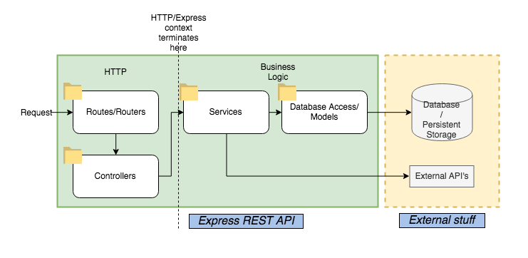

# Node Express, MongoDB, moongoose

 

To run locally:

- npm install

### April 9, 2021

- created the standard folder strcutre following the 3-layer architecture production ready folder strcuture
- created the src folder
- created the test root foler--for integration tests, unit tests and acceptance tests.
